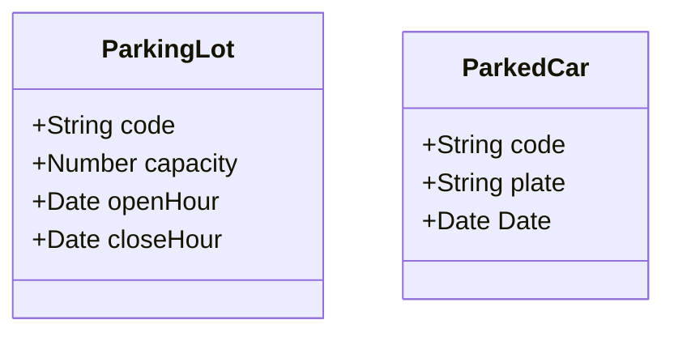
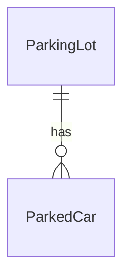

# docs/README.md

## Data model

```mermaid
classDiagram
  class ParkingLot{
    +String code
    +Number capacity
    +Date openHour
    +Date closeHour
  }
  
  class ParkedCar{
    +String code
    +String plate
    +Date Date
  }
```

## Relations

```mermaid
erDiagram
 ParkingLot 1--0+ ParkedCar : has
```